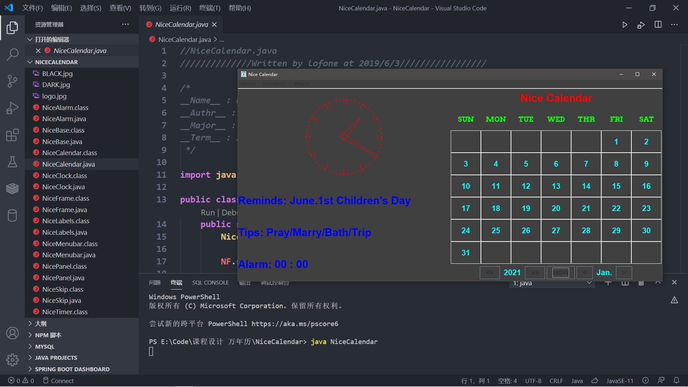

### 使用说明：将所有的.java文件放在同一个文件夹下，编译NiceCalendar.java，即可运行

# Calendar
Java 课程设计，万年历(Java Swing)
制作一个万年历，包括以下功能：
#### 基本功能：
-	获取当前日期并显示
-	获取当前时间并显示
-	能够跳转到任意时期并显示
-	使用图形用户界面
#### 扩展功能：
-	能够显示节日提醒、占卜提示
-	能够更改界面风格（换肤）
-	能够设置闹钟并提醒

## 如果觉得有用烦请给个小星星

**2021.01.28修改：上传了作者当年的课程设计报告，添加了一些界面展示图例**

